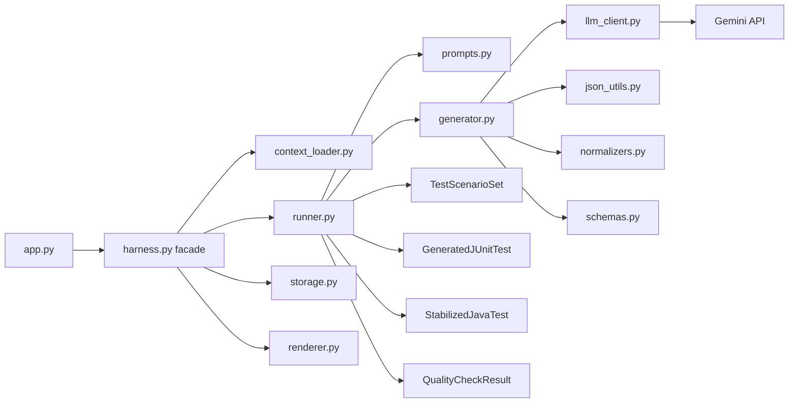

# LLM Test Harness for Spring Service

Spring 서비스 코드와 기능 설명을 입력으로 받아, 테스트 시나리오 생성부터 JUnit 테스트 코드 생성, 코드 안정화, 품질 검증까지 수행하는 LLM 기반 하네스 프로젝트.

> 2026-04-09

## Overview

이 프로젝트는 하나의 LLM을 여러 역할로 분리해 파이프라인 형태로 사용한다.

Pipeline:

1. Spring 서비스 코드 및 기능 설명 입력
2. 테스트 시나리오 JSON 생성
3. JUnit5 + Mockito 테스트 코드 메타데이터 생성
4. Java 테스트 코드 렌더링
5. 생성된 Java 테스트 코드 안정화
6. 테스트 코드 품질 검증 및 점수화

## Why

LLM은 바로 컴파일 가능한 테스트 코드를 항상 안정적으로 만들지 못한다.  
따라서 단일 프롬프트 호출 대신, 아래와 같은 단계형 하네스를 구성했다.

- 중간 산출물을 JSON으로 저장
- 스키마 검증 수행
- enum/type normalization 수행
- retry 로직 추가
- 생성 코드 안정화
- 품질 평가 단계 추가

## Project Structure

```text
llm-test-harness/
  app.py
  harness.py
  prompts.py
  schemas.py
  samples/
    feature.txt
    service.java
  outputs/
```

## env 파일 구조

```plain text
GEMINI_API_KEY={gemini_api_key}
GEMINI_MODEL=gemini-3.1-flash-lite-preview
```

## Tech Stack

- Python
- Gemini API
- Pydantic
- dotenv

## Output Files

- `outputs/test_scenarios.json`
- `outputs/generated_junit_test.json`
- `outputs/UserServiceTest.java`
- `outputs/stabilized_junit_test.json`
- `outputs/UserServiceTest.stabilized.java`
- `outputs/test_quality_report.json`

## Example Flow



<details>
<summary>Detailed Flow</summary>



</details>

```mermaid
flowchart TD
    A[app.py 실행] --> B[load_project_context]
    B --> C[run]
    C --> D[build_user_prompt]
    D --> E[generate_with_retry]
    E --> F[call_llm_for_json]
    F --> G[Gemini API]
    G --> F
    F --> H[extract_json]
    H --> I[json.loads]
    I --> J[normalize_test_case_values]
    J --> K[TestScenarioSet 검증]
    K --> L[scenario_result 저장]
    L --> M[run_junit_generation]
    M --> N[build_junit_prompt]
    N --> O[generate_with_retry]
    O --> P[call_llm_for_json]
    P --> Q[Gemini API]
    Q --> P
    P --> R[extract_json]
    R --> S[json.loads]
    S --> T[normalize_junit_result]
    T --> U[GeneratedJUnitTest 검증]
    U --> V[junit_result 저장]
    V --> W[render_junit_java]
    W --> X[UserServiceTest.java 저장]
    X --> Y[run_java_stabilization]
    Y --> Z[build_stabilize_prompt]
    Z --> AA[generate_with_retry]
    AA --> AB[call_llm_for_json]
    AB --> AC[Gemini API]
    AC --> AB
    AB --> AD[extract_json]
    AD --> AE[json.loads]
    AE --> AF[normalize_stabilized_java_result]
    AF --> AG[StabilizedJavaTest 검증]
    AG --> AH[stabilized 결과 저장]
    AH --> AI[stabilized java 파일 저장]
    AI --> AJ[run_quality_check]
    AJ --> AK[build_quality_prompt]
    AK --> AL[generate_with_retry]
    AL --> AM[call_llm_for_json]
    AM --> AN[Gemini API]
    AN --> AM
    AM --> AO[extract_json]
    AO --> AP[json.loads]
    AP --> AQ[normalize_quality_result]
    AQ --> AR[QualityCheckResult 검증]
    AR --> AS[quality report 저장]
```

Input:

- Spring `UserService.register()` method
- feature description

Output:

- 정상/경계/예외 테스트 시나리오
- Mockito 기반 JUnit 테스트 코드 초안
- import/annotation 보정된 안정화 코드
- 품질 점수 및 개선 제안

## Limitations

- 실제 Java 프로젝트 컴파일까지 자동 보장하지는 않음
- 도메인 클래스(`User`, `UserRepository`) 정의가 부족하면 잘못 추론할 수 있음
- 테스트 초안은 사람이 최종 검토해야 함

## Future Work

- `javac` 또는 Gradle test compile 단계 자동 실행
- 컴파일 에러 로그를 다시 LLM에 넣어 수정하는 루프 추가
- Controller / Repository / Integration Test로 확장
- GitHub Actions 연동
